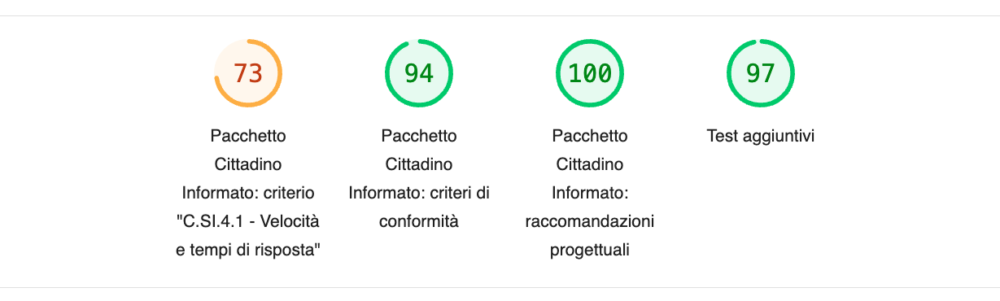

Il report e i risultati
=======================

Una volta effettuata l’analisi, il report si aprirà automaticamente. Il report viene salvato nella cartella indicata dall'App.

Barra superiore
---------------

   Barra superiore del report.

.. attention::

   Nella barra superiore, i colori e il punteggio degli indicatori **non indicano** il risultato del superamento dei test.

Il punteggio è valido solo per **Velocità e tempi risposta** (Criterio *C.SI.4.1 - Velocità e tempi di risposta* per i siti dei Comuni e Raccomandazione progettuale *R.SC.3.1 - Velocità e tempi di risposta* per i siti delle scuole. 

Per i gruppi di criteri, il numero visualizzato è una percentuale di quanti test sono stati passati in quel gruppo ma non è da considerarsi valido ai fini del processo di valutazione tecnica. 

Cliccando su un criterio o un gruppo, puoi saltare alla sezione del report con informazioni aggiuntive.

Legenda
-------

**Pallino verde:** il test è superato (successo).

**Quadrato giallo:** il test è superato ma ci sono spazi di miglioramento (tolleranza).

**Triangolo rosso:** il test non è stato superato (fallimento).

**Cerchio grigio:** il test è informativo e fornisce informazioni sulle buone pratiche da rispettare, ma non restituisce una valutazione applicata al sito analizzato.

Sezione Velocità e tempi di risposta
------------------------------------

Questa sezione fa riferimento nello specifico al criterio *C.SI.4.1 - Velocità e tempi di risposta* per i siti dei Comuni e alla raccomandazione progettuale *R.SC.3.1 - Velocità e tempi di risposta* per i siti delle scuole.

Nella sezione *Metriche*, vengono presentati i risultati delle 6 metriche (First Contentful Paint, Speed Index, Largest Contentful Paint, Time to Interactive, Total Blocking Time, Cumulative Layout Shift) che concorrono al punteggio del criterio di conformità o della raccomandazione. 

Per i siti dei Comuni soltanto, nel caso di punteggio totale inferiore a 50, è necessario pubblicare sul sito comunale un «Piano di miglioramento del sito» che mostri, per ciascuna metrica che impatta negativamente la performance, le azioni future di miglioramento della performance stessa e le relative tempistiche di realizzazione attese.

Le sezioni *Opportunità*, *Diagnostica* e *Controlli superati* mostrano i risultati di altri test che lighthouse svolge in automatico. Possono essere utili a valutare miglioramenti del sito.

Sezione criteri o raccomandazioni
---------------------------------

Le altre sezioni del report mostrano i risultati relativi ai criteri di conformità e alle raccomandazioni, suddivisi per tipologia (Esperienza utente, Funzionalità, Normativa, Performance, Sicurezza).

In alto vengono visualizzati i test non superati (fallimento), quelli superati ma che presentano spazi di miglioramento (tolleranza) e quelli informativi.

I test superati (successo) vengono raggruppati in basso.

Sezione Test aggiuntivi
-----------------------

In questa sezione viene presentato il risultato per la raccomandazione Localizzazione IP.

Tutti gli altri sono test standard forniti da Lighthouse. Non sono rilevanti in termini di raggiungimento dei criteri di conformità, ma rappresentano comunque indicazioni utili a valutare eventuali miglioramenti del sito.

Il risultato e le indicazioni di alcuni di questi test sono in inglese come impostazione default di Lighthouse e non è possibile cambiare lingua.

