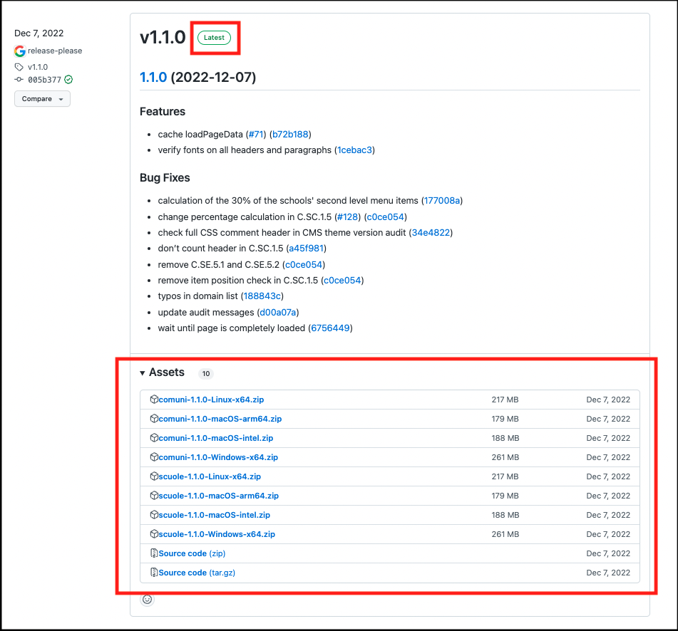
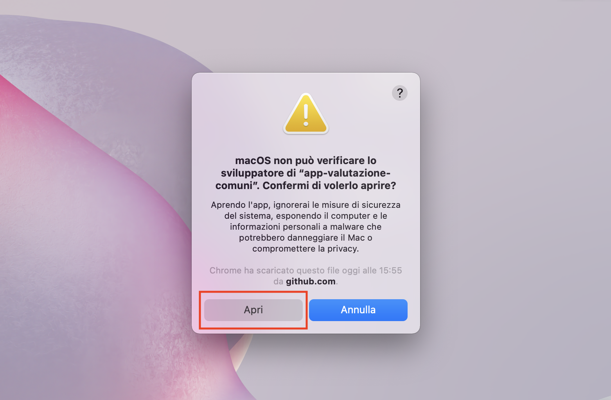
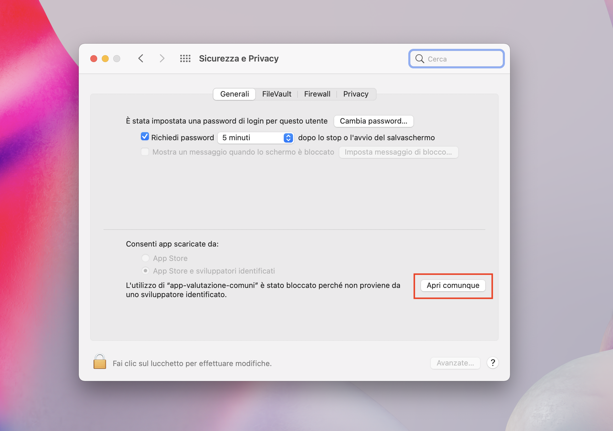
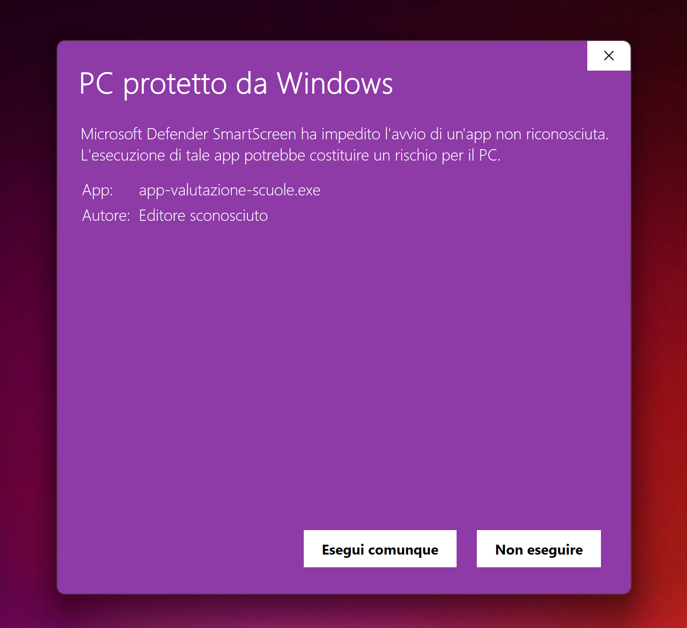
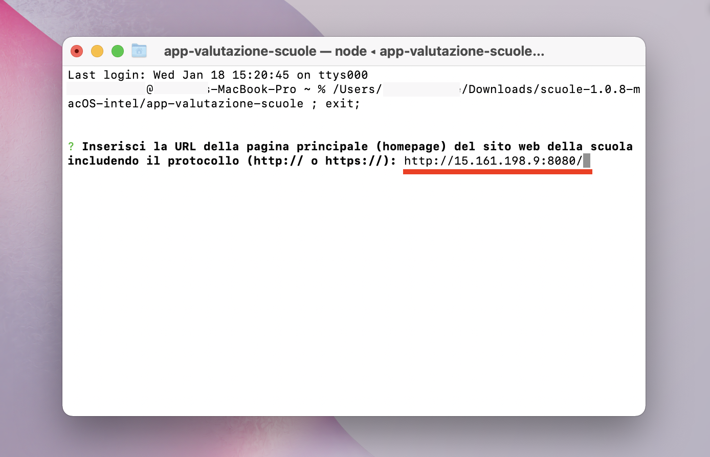
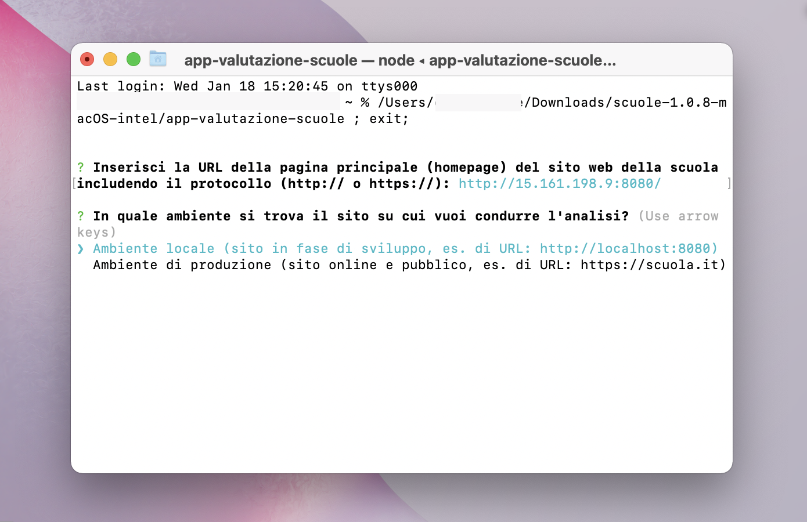
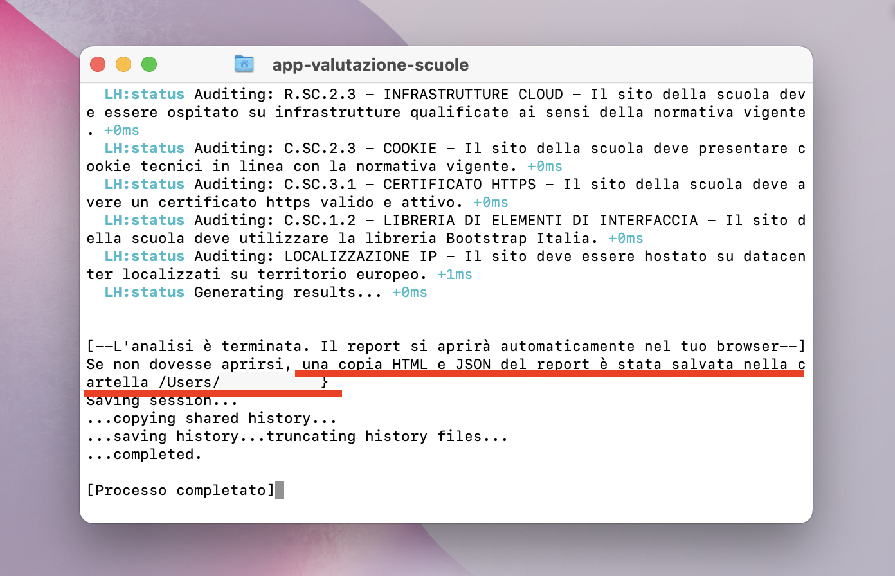

Installazione e uso delle app
=============================

Le App di valutazione sono distribuite sotto forma di file zip, contenenti l’eseguibile del programma e un file readme di istruzioni.

Per scaricare l'app e avviare una valutazione: 
   
1. `Vai sul repository GitHub <https://github.com/italia/pa-website-validator/releases>`_.

2. Individua l'app corretta in base al modello di riferimento (comuni/scuole), sistema operativo (macOS/windows/linux) e processore (intel/arm64/x64) e clicca per scaricare il file zip. Assicurati che la release sia l'ultima disponibile, contrassegnata dall'etichetta verde "Latest".

   La lista dei file di installazione.

3. Estrai il file zip sul tuo computer.

4. Avvia il file eseguibile per far partire l'app.
   
5. Se richiesto, dai l'autorizzazione ad aprire il file. 
      
      Su *mac*, clicca su 'Apri' nella finestra di dialogo. 
      

   La finestra di dialogo dove dare i permessi su mac per aprire l'app.
   
      
      Se il pulsante Apri non è disponibile, è necessario andare in Preferenze di sistema > Sicurezza e Privacy. Nella tab 'Generali', assicurati sia selezionata l'opzione 'App Store e sviluppatori identificati' sotto la voce 'Consenti app scaricate da' . Se la finestra è oscurata e non è possibile effettuare modifiche, clicca sul lucchetto in basso a sinistra e inserisci la tua password. Troverai un messaggio riguardante il file che hai appena cercato di aprire. Clicca su 'Apri comunque'. Potrebbe comparire un'ulteriore finestra di dialogo dove è necessario cliccare su 'Apri'.
      
      

   La finestra nelle impostazioni del mac dove dare i permessi per l'app.
      
      
      Su *Windows*, al messaggio di avviso sulla sicurezza dell'app, clicca sul testo 'Maggiori informazioni'. Nella seconda finestra di dialogo, clicca su 'Esegui comunque'.
      
      

   La finestra di dialogo dove dare i permessi su Windows per aprire l'app.

6. Quando richiesto, nella finestra di comando, inserisci l'URL del sito su cui condurre l'analisi e premi invio. L’URL deve comprendere il protocollo (http:// o https://).

   

   Dove inserire l'url del sito nell'App di valutazione.
   

7. Usando le frecce sulla tastiera, sposta il cursore per selezionare se il sito è in un ambiente locale (sito in fase di sviluppo) o di produzione (visibile al pubblico) e premi invio.

   

   
   Selezione dell'ambiente su cui è ospitato il sito che si vuole analizzare.
   

8. Attendi qualche secondo che l'app inizi l'analisi. Per il completamento ci vorranno circa 3 minuti.

9. Consulta il report che si aprirà automaticamente al termine dell'analisi. Il report viene salvato nella cartella indicata dall'app.

   
   Termine dell'analisi e indicazione della cartella di salvataggio.

